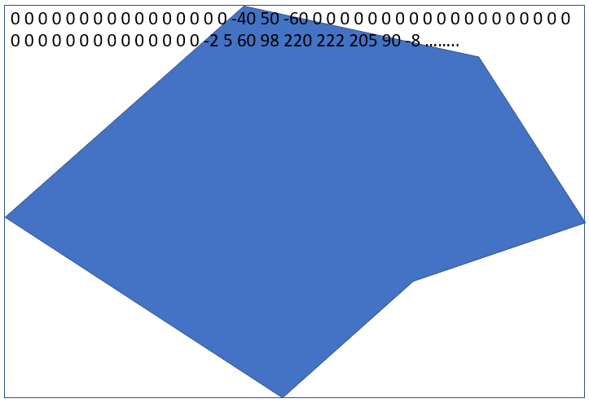

<a name="readme-top"></a>
<!--
*** Template: https://github.com/othneildrew/Best-README-Template
-->

<!-- PROJECT LOGO -->
<br />
<div align="center">

<a>
    
  </a>

  <h1 align="center">Skitour - Carte neige et avalanches</h3>

  <p align="center">
    Une carte interactive pour le site Skitour, affichant la neige fraîche, totale et le risque nivologique à partir des bulletins Météo France.
    <br />
    <a href="https://github.com/poitevie/Skitour"><strong>Documentation »</strong></a>
    <br />
    <br />
  </p>
</div>

## Génération des fichiers binaires
Avant d'être utilisé, cet outil nécessite une phase de génération de plusieurs fichiers `hgt` basés sur le fichier `api/geojson/massifs.geojson` (décrivant les coordonnées des massifs) et sur le dossier `api/hgt/maillage/` contenant les fichiers d'altitudes (ex: N41E008.hgt).
Cette phase de génération est à éxecuter une seule fois ou après chaque modification du fichier `api/geojson/massifs.geojson` ou des fichiers du dossier `api/hgt/maillage/`.
### Etapes de génération
1. Premièrement, lancer le script `api/hgt/altitude.php`. Ce script génère dans le dossier `api/hgt/massifs/altitude/` un ensemble de fichiers `hgt` contenant des altitudes. Il y a un fichier `hgt` généré par massif décrit dans le fichier `api/geojson/massifs.geojson`.
Chaque fichier respecte la structure suivante :
- Le nombre de points en largeur du fichier (2 octets / 'n')
- Le nombre de points en hauteur du fichier (2 octets / 'n')
- La latitude du point en bas à gauche du fichier (4 octets / 'f')
- La longitude du point en bas à gauche du fichier (4 octets / 'f')
- La latitude du point en haut à droite du fichier (4 octets / 'f')
- La longitude du point en haut à droite du fichier (4 octets / 'f')
- N altitudes en mètres (2 octets par altitude / 'n')

La première altitude est celle du point en haut à gauche et la dernière altitude et celle du point en bas à droite.
Toutes les altitudes en dehors du massif (décrit dans le fichier `api/geojson/massifs.geojson`) sont définies à 0.



Les noms des fichiers suivent le schéma suivant : `<id du massif>.hgt` (ex: Chartreuse -> `07.hgt`)

2. Puis lancer le fichier `api/hgt/orientation.php`. Ce script génère dans le dossier `api/hgt/massifs/orientation/` un ensemble de fichiers `hgt` contenant des orientations. Un fichier est généré par massif et chaque fichier suit la même structure que les fichiers d'altitudes.
Les données d'orientations vont de 1 à 9. La correspondance est la suivante :
- `1` pour `Nord Ouest`
- `2` pour `Nord`
- `3` pour `Nord Est`
- `4` pour `Ouest`
- `5` pour `Sommet`
- `6` pour `Est`
- `7` pour `Sud Ouest`
- `8` pour `Sud`
- `9` pour `Sud Est`

3. Puis lancer le fichier `api/hgt/pente.php`. Ce script génère dans le dossier `api/hgt/massifs/pente/` un ensemble de fichiers `hgt` contenant des pentes. Un fichier est généré par massif et chaque fichier suit la même structure que les fichiers d'altitudes.
Les données des pentes sont en degrés.

## Génération des images

Pour générer les images qui servent à afficher de l'information sur la carte il faut lancer plusieurs scripts. Ces scripts se situent dans le dossier `api/images/`. Les scripts `neigefraiche.php`, `neigefraicheprevision.php`, `neigetotale.php`, `risque.php` dépendent des bulletins de météo france. Ils doivent être déclenchés après chaque mise à jour de ces bulletins.
Les scripts génèrent une image par massif dans le dossier correspondant (ex: les images de neige fraiche se situent dans le dossier `api/images/neigefraiche`).

Les noms des images suivent le schéma suivant : `<id du massif>.png` (ex: Chartreuse -> `07.png`)

Il est possible de générer une image pour un massif en particulier, en spécifiant l'id du massif en paramètre du script. Exemple pour générer l'image de neige totale du massif d'id 07 (Chartreuse) :
```
php neigetotale.php 07
```
