# Rapport de projet : Carte neige et avalanches

Porteur du projet : Jeroen Zijp (Skitour.fr)

Membres : BACH Thomas - FOURNIER Thomas - GUIGNARD Julien - POITEVIN Eve

# I. Présentation du contexte

Skitour.fr est le principal site français dédié au ski de randonnée, une activité en pleine expansion. Son objectif premier est de fournir aux skieurs de randonnée un espace où ils peuvent échanger des informations sur leur pratique et disposer d'outils pour préparer leurs sorties. Cela comprend une base de données d'itinéraires, de sommets, de points de départ et de refuges, ainsi que des comptes-rendus de sorties avec des descriptions détaillées des itinéraires, des conditions nivologiques rencontrées, des photos et des commentaires. Skitour propose également des liens vers divers sites, tels que des webcams, des nivoses et des prévisions météorologiques.

Le site a été entièrement repensé en 2021 pour se conformer aux normes web les plus récentes, notamment en devenant responsive, en proposant une application web progressive (installable, notifications), en utilisant largement l'ajax, en intégrant une cartographie et en offrant une synchronisation avec les réseaux sociaux et les applications sportives comme Strava ou Garmin.

Les informations sur la neige et les avalanches sont disponibles via le bulletin météo France (exemple :[ https://api.meteofrance.com/files/mountain/bulletins/BRA01.xml](https://api.meteofrance.com/files/mountain/bulletins/BRA01.xml)), mais elles ne sont pas agrégées et sont donc peu lisibles et peu pratiques pour les utilisateurs. 

L'objectif du projet est d'afficher sur une carte les données sur la neige fraîchement tombée, la neige totale et le risque nivologique, pour ensuite pouvoir être intégré sur Skitour.


# II. Technologies et outils utilisés

Les technologies utilisées pour le projet comprennent PHP pour le back-end, ainsi que HTML, JavaScript, et Leaflet pour le front-end. Le JSON  est également utilisé pour le transfert et le stockage de données. 

Ces choix sont judicieux pour plusieurs raisons :

Tout d'abord, PHP est un langage de programmation populaire pour la création de sites web dynamiques, offrant une grande flexibilité.

JSON est un format de données léger et facile à lire, idéal pour transmettre des données entre le back-end et le front-end.

HTML est utilisé pour la structure et pour intégrer les éléments de la page web.

Ensuite, JavaScript est un langage de programmation incontournable pour les projets de création de cartes interactives, car il permet de manipuler la carte et de créer des interactions utilisateur dynamiques. Enfin, Leaflet est une bibliothèque JavaScript open-source pour la création de cartes interactives sur le web, offrant une grande souplesse et une multitude de fonctionnalités telles que le zoom, la recherche, les icônes personnalisées, etc.

Pour la gestion de projet, l’équipe utilise GitHub et JIRA, deux outils de gestion de projet largement utilisés dans l'industrie du développement logiciel. GitHub permet de stocker le code source du projet et de le partager entre les développeurs, tandis que JIRA est un outil de suivi des problèmes et des tâches qui permet aux membres de l'équipe de suivre l'avancement du projet et de gérer les priorités.


# III. Architecture technique

Notre système actuel repose sur des fichiers binaires contenant les valeurs d’altitude, d’orientation et de pente, ainsi que les bulletins météorologiques quotidiens de Météo France. Dans ces bulletins, les informations concernant les risques, la neige fraîche et la neige totale sont parsées afin de les croiser aux informations des fichiers binaires pour calculer et générer des images des massifs pour le risque, la neige fraîche et la neige totale. Du côté du client, lors de l’affichage de sa carte sur son écran, un appel est effectué pour récupérer les images au serveur puis de les afficher à l’endroit correspondant sur la carte. Les appels au serveur sont effectués uniquement si le massif correspondant est visible sur la carte.  

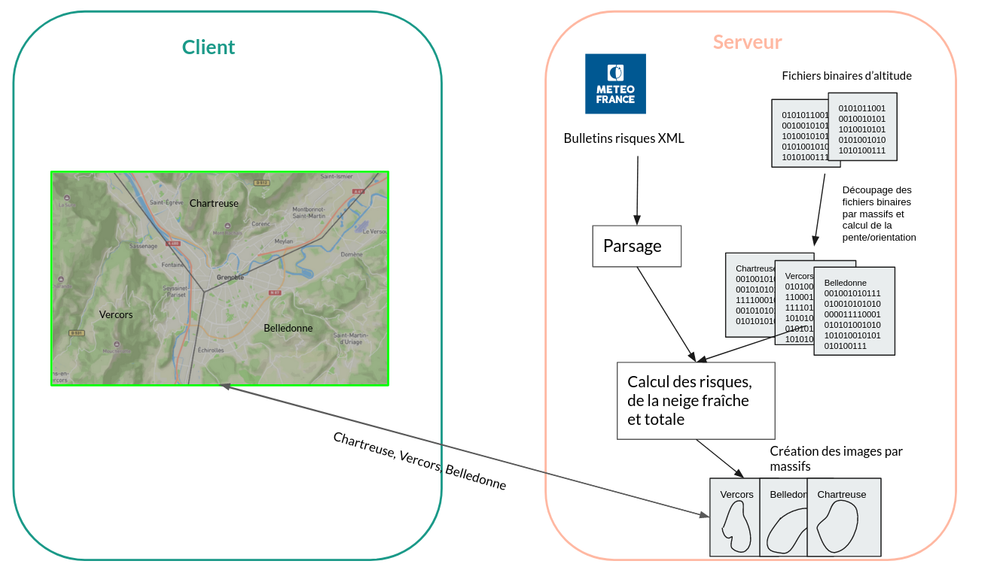

```Image 1 : Architecture technique de l'application```

# IV. Réalisation technique

Pour entamer notre travail, nous avons pris la décision stratégique de générer un fichier d’altitude par massif plutôt que global, dans le but de minimiser le traitement des données inutiles en dehors des massifs. Ainsi, nous avons déterminé les délimitations de 36 massifs répartis sur les Alpes, les Pyrénées et la Corse, pour générer un fichier binaire autour de chaque massif. Pour faciliter ce processus, nous avons créé un rectangle autour de chaque massif, où les valeurs en dehors de ces rectangles sont nulles, ce qui simplifie le fichier binaire à traiter.

Ensuite, nous avons entamé le processus de parsage et de récupération des fichiers BRA (Bulletin de Risque d'Avalanche) pour obtenir les données relatives aux risques d’avalanche. Dans un premier temps, nous avons affiché les risques d’avalanche associés à chaque massif sans appliquer d'autres conditions. Cependant, pour pouvoir appliquer des conditions plus précises, nous avons dû lier les informations du bulletin de risques d’avalanche avec l'orientation du massif, l'altitude et la pente. Nous avons calculé la pente et l'orientation grâce aux fichiers d'altitudes.

Pour les calculs de la pente et de l'orientation, nous utilisons un fichier binaire de massif à partir duquel nous récupérons l'altitude de tous les points. Nous parcourons notre fichier binaire comme un tableau de tableau qui représente une zone rectangulaire autour du massif. Les points situés en dehors de la zone de délimitation du massif ont leur altitude notée à 0m afin de ne pas les prendre en compte. Nous savons que dans la zone des massifs, l'altitude est toujours supérieure à 0. Chaque point dans la zone des massifs possède une valeur correspondant à son altitude.

Par la suite, nous effectuons un calcul pour chaque point pour déterminer son orientation et sa pente. 

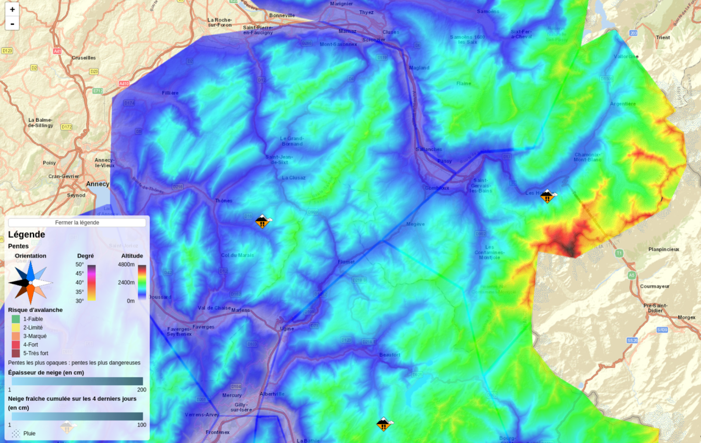

```Image 2 : Carte des altitudes```


Lorsque nous traitons un point du massif, nous avons accès à son altitude dans notre fichier binaire. Ce fichier est organisé de telle sorte que le point [0,0] correspond au point en haut à gauche de notre tuile de massif. Nous disposons ainsi des données des points environnants pour chaque point du massif.

Pour calculer la pente à partir de ces données, nous comparons l'altitude du point actuel avec l'altitude des 8 points voisins. Nous cherchons ensuite la différence d'altitude maximale entre le point voisin et notre point. Si cette différence maximale est inférieure à 0, nous considérons le point actuel comme un sommet.

Si la différence maximale est supérieure à 0, nous pouvons déduire l'orientation grâce au point ayant la plus grande différence d'altitude. Par exemple, si ce point est au nord, notre point actuel aura une orientation sud, car la pente sera exposée vers le sud.

Une fois l'orientation déterminée, nous connaissons la distance d'écart entre les deux points et la différence d'altitude. Nous pouvons alors calculer la pente en degrés en utilisant la formule suivante : _pente = arctan(diff/dist)*(180/PI)_, avec diff représentant la différence d'altitude entre les deux points et dist représentant la distance entre les deux points.

En utilisant des données topographiques, nous avons pu calculer l'orientation et la pente de tous les massifs de France. Ce processus implique une étape de parcours de tous les points, suivie de plusieurs calculs par point. Bien que cette procédure soit chronophage, elle ne doit être exécutée qu'une seule fois et peut ensuite être utilisée sans avoir besoin de régénérer les données.


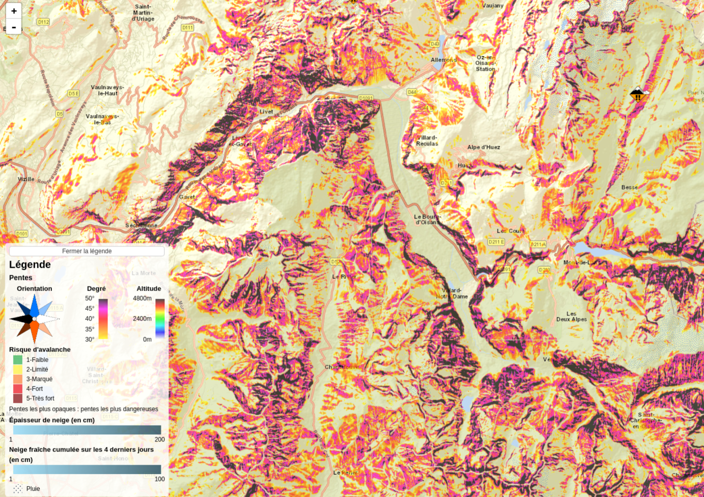

```Image 3 : Carte des orientations```


En outre, en délimitant les massifs, nous avons développé une fonction permettant de déterminer les images de massifs à afficher en fonction de la carte présentée à l'écran. Cette approche permet de n'afficher que les massifs visibles à l'écran, évitant ainsi le chargement de données inutiles.

Les risques associés aux pentes supérieures à 30° sont affichés, en utilisant les orientations et altitudes fournies dans le parsing du fichier XML, car cela peut modifier le risque. Pour améliorer l'efficacité, nous avons développé une fonctionnalité de gestion de zoom et de déplacement sur la carte, qui actualise les massifs à afficher en fonction du zoom et du déplacement.

Dans un souci d'affichage plus rapide, nous avons opté pour la génération des images côté serveur avant de les transmettre au client pour affichage. Cette approche nous a permis de gagner du temps, car les données ne sont générées qu'une fois par jour. En outre, nous avons commencé la préparation de l'affichage de plusieurs cartes en générant des couches par Leaflet.

Ces améliorations contribuent à l'efficacité de notre système de visualisation des risques associés aux massifs montagneux, tout en améliorant l'expérience utilisateur en offrant une navigation plus fluide et une visualisation précise des risques.

Notons pour la suite, qu’il est possible qu'il y ait deux risques différents dans le massif en fonction des conditions.

Les différentes conditions possibles pour le risque sont notamment : 


* Les risques évolutifs partant d’une valeur pour en atteindre une autre. Cela signifie que selon l’évolution des conditions météorologiques, le risque peut évoluer et varier. 
* Un risque qui dépend de l’orientation. Selon la face de la montagne et son orientation, le risque peut varier. 
* Un risque qui dépend de l’altitude. Le risque vaut une certaine valeur sous une altitude et est différent au-dessus de cette altitude. 
* Un risque unique pour toute la montagne.


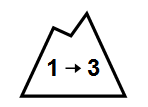

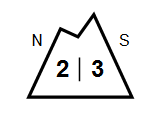

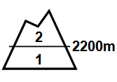

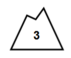

```Image 4 : Différents logos de risque d'avalanche```

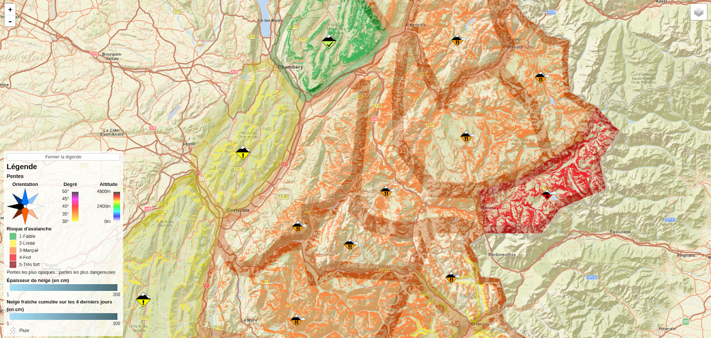

```Image 5 : Carte des risques d'avalanche```


Nous avons récupéré des données relatives aux couches de neige totale ainsi que la quantité de neige fraîche tombée et à tomber. Pour obtenir des informations sur la neige totale, nous utilisons les données d'enneigement des bulletins météo France, qui fournissent des informations sur l'enneigement sur le versant nord et le versant sud pour 3 paliers différents : 1000m, 1500m, 2000m et 2500m. Les données ne sont affichées sur la carte que si le point a une altitude supérieure à l'altitude minimale d'enneigement total.

Pour la neige fraîche et la prévision de neige fraîche, nous récupérons les données météorologiques du bulletin qui contiennent la quantité de neige fraîche tombée à 1800m ou indiquent qu'il n'y a rien ou de la pluie. Étant donné que nous n'avons qu'une valeur pour la quantité de neige fraîche, nous affichons des données entre 1800m et le sommet du massif. Nous récupérons également la valeur de l'ISO 0, qui est l'altitude où la température est de 0°C, pour indiquer qu'entre cette altitude et 1800m, il peut y avoir de la neige, car les conditions météorologiques sont favorables.

Nous avons ajouté les trois couches (risque d’avalanches, neige totale et neige fraîche) sur la carte, ainsi que les couches de pente, d'altitude et d'orientation obtenues à partir des fichiers d'altitude.

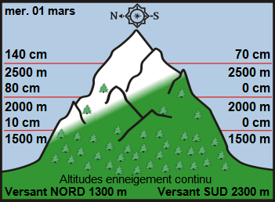

```Image 6 : Informations sur l'enneigement continu```


La figure (Image 6) est utilisée pour recueillir des données sur la quantité de neige totale dans une région montagneuse. Les relevés de neige sont effectués à des altitudes spécifiques sur deux versants différents, à savoir le nord et le sud, pour tous les fichiers. En outre, une valeur d'enneigement continu est fournie en bas, qui est utilisée pour générer la carte. Les points situés à une altitude inférieure à l'altitude de l'enneigement continu ne sont pas affichés sur la carte.

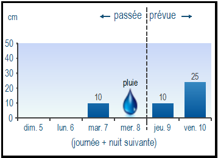

```Image 7 : Chutes de neige fraîche passée et à venir```


Les données sur la neige fraîche et les prévisions météorologiques sont collectées en analysant les données des quatre derniers jours ainsi que les prévisions des deux prochains jours. La quantité de neige fraîche est enregistrée pour chaque jour, tandis qu'un symbole de pluie est utilisé en cas de précipitations pluvieuses. La carte affiche la somme des quantités de neige fraîche des quatre derniers jours ainsi que la somme des prévisions de neige fraîche pour les deux prochains jours. Les données de neige fraîche ne sont disponibles que pour l'altitude de 1800 mètres. Pour les altitudes situées entre 1800 mètres et l'altitude de l'iso 0, qui correspond à l'altitude à laquelle la température est de 0 °C ou moins, une valeur de neige fraîche de 1 est affichée sur la carte pour indiquer la possibilité de présence de neige fraîche dans ces zones.

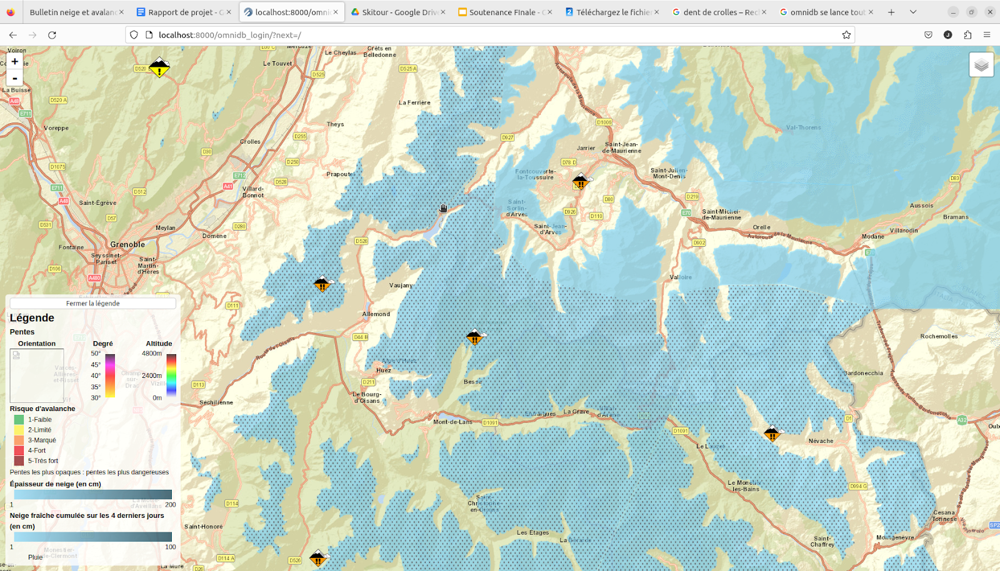

```Image 8 : Carte de la neige tombée```

Afin d’augmenter la lisibilité de notre carte ainsi que sa compréhension, nous avons rajouté une légende décrivant les différentes couches que notre carte propose. Celle-ci peut être cachée si elle dérange l’utilisateur lors de son utilisation du site.

Également, une icône est ajoutée à l’intérieur de chaque massif correspondant à son risque, lorsqu’on clique sur cette icône, le bulletin météorologique de Météo France correspondant à ce massif s’affiche à l’écran afin que l’utilisateur puisse voir les commentaires laissés par Météo France sur ce massif.


```Image 9 : Icône de neige incertaine```


L’icône de l’image 9 est présente sur 7 massifs (Cerdagne-Canigou, Haute-Bigorre, Haute-Tarentaise, Haute-Maurienne, Queyras, Ubaye, Thabor) lors de l’affichage des couches de neige fraîche. Cette icône indique que les valeurs de neige peuvent différer au sein du massif à cause de la présence de différences significatives de tombées de neige entre les parties nord/sud ou est/ouest du massif.

Pour finir, comme on peut voir sur l’image 5, des contours sont assombris afin d’indiquer que les valeurs dans ces zones peuvent être imprécises. En effet, les contours des massifs ont été délimités par nous-même à la main, ce qui peut provoquer des imprécisions. De ce fait, tous les points à une distance de moins de 4.5km de la bordure du massif sont assombris afin d’indiquer des imprécisions. 


## Choix de conception

1. Création des images côté serveur 

Au début de notre projet, nous avions pour idée de transmettre les données au client pour générer les images dans la partie client. L’objectif de cela était de diminuer la surcharge du serveur en utilisant la puissance de calcul des utilisateurs pour générer les images. Avec cette méthode, le temps d’affichage par massif était d’environ 5 à 10 secondes. Après discussion avec notre tuteur de stage, nous avons pris la discussion d’essayer de générer les images côté serveur puis de transférer l’image. Nous avons testé au début afin de pouvoir comparer les données. Nous générons ainsi les images côté serveur puis effectuons une transmission pour un résultat de moins d’une seconde pour la génération et la transmission. Nous avons donc choisi de garder la génération du côté serveur, d’autant plus qu’il y a seulement 144 générations à faire par jour soit 4 par massif par jour. 


2. Gestion d’un grand nombre de points 

Afin de réduire les temps de génération et de parcours de fichiers, nous avons décidé d’utiliser des fichiers binaires pour stocker les informations plutôt que des fichiers JSON ou autre. Ces fichiers pouvant parfois contenir des millions de points, cela permet de gagner un temps non négligeable. Nous avons donc créé un fichier binaire par massifs pour l’altitude, mais également pour l’orientation et la pente. Ainsi pour le calcul quotidien des cartes, le parcours dans les fichiers binaires est plus efficace.

3. Choix des couleurs affichées

Pour les couleurs des différentes informations, nous avons choisi des couleurs communiquant l’information efficacement. Pour les altitudes, les couleurs vont du bleu au rouge foncé pour visualiser les zones les plus basses (bleu) et les zones les plus hautes (rouge). Pour les orientations, les points cardinaux opposés sont signalisés par des couleurs bien différentes et la couleur d’un point cardinal intermédiaire est la continuité de la couleur de ses points adjacents. Pour les pentes, les couleurs sont les mêmes que celles du site Géoportail, nous avons ajouté un dégradé entre les paliers pour plus de précision. Pour les risques d’avalanches, nous avons choisi de prendre les mêmes couleurs que les couleurs de risques d’avalanches (convention internationale). Enfin, pour la représentation de l’épaisseur de neige, nous avons pris une échelle de bleu allant du bleu clair (peu de neige) au bleu foncé (beaucoup de neige) pour représenter progressivement l’épaisseur. Notons que lorsque de la pluie est tombée, nous avons choisi de représenter cela par des points foncés, ainsi lorsqu’il tombe de la neige et de la pluie, les deux informations sont lisibles en même temps grâce à la superposition.


## Difficultés techniques rencontrées 

Une des difficultés rencontrée lors de notre projet est la délimitation des massifs. En effet, via Météo France et ses bulletins météorologiques, les informations que nous souhaitons afficher nous sont communiquées par massif mais nous n'avons aucun moyen de savoir à quel massif ou non appartient un point. De ce fait, nous avons recherché sur internet une API ou un fichier contenant les délimitations de ces différents massifs mais nous n’avons rien trouvé. Ainsi, nous avons pris la décision de créer un fichier JSON contenant les contours des 36 massifs pour pouvoir ensuite afficher les valeurs correspondant à un massif au bon endroit.  Pour définir les massifs nous avons utilisé les délimitations trouvées sur des images en ligne ainsi que le site [https://geojson.io/](https://geojson.io/)<span style="text-decoration:underline;"> </span>pour enregistrer les délimitations des massifs au format JSON. 

Toujours en rapport avec les délimitations de massif, certains massifs ont des sous-massifs dans les données météorologiques de tombées de neige fraîche. Les tombées de neige sont différentes entre les 2 massifs selon la disposition du terrain , du vent ou autres possibilités. Or nous n’avons pas de données fiables pour délimiter ces sous massifs, d’autant plus qu’ils sont variables selon les années et les conditions. De ce fait, nous ne prenons pas en compte les sous-massifs, seule la neige du sous massif numéro 1 est prise en compte. Il ne nous est pas possible de faire la moyenne des 2 massifs car cela fausserait la carte pour les 2 sous massifs. Cette partie du projet devra être retravaillée lorsqu’une délimitation précise des sous massifs sera effectuée. En attendant, l’icône de l’image 9 est présente sur les 7 massifs ayant des sous-massifs pour signaler aux utilisateurs de faire attention aux données de neige fraîche de ces massifs.


# V. Gestion de projet

Pendant la durée de notre projet, Eve Poitevin a rempli le rôle de chef de projet tandis que Thomas Bach avait le rôle de Scrum Master. Les rôles techniques n'étaient pas spécifiquement attribués aux membres de l'équipe, chacun ayant la possibilité de travailler sur la partie front-end et sur la partie back-end en fonction des besoins et des moments du projet.

Nous avons utilisé Jira, un logiciel de gestion de projet agile complet pour la gestion de nos tâches, notes et autres documents. Le projet était découpé en cinq sprints, chacun ayant une série de tâches assignées, déplaçables entre les colonnes "À faire", "En cours" et "Fini". Cela nous a permis de suivre l'avancement en temps réel des tâches prévues pour le sprint et d'avoir une vue d'ensemble de ce qu'il restait à accomplir. Nous pouvions également ajouter une description, des images et des membres pour chaque tâche. Avant le début de chaque sprint, nous avons organisé une réunion pour discuter du sprint précédent, identifier les défis et les opportunités, et élaborer un "sprint backlog" pour le sprint à venir.

Les objectifs des 5 sprints étaient les suivants :


* Sprint 1 (1 semaine): Comprendre le sujet, explorer les données et les technologies disponibles
* Sprint 2 (1 semaine): Acquérir les fichiers d'altitude pour chaque massif (délimitations, génération des binaires)
* Sprint 3 (2 semaines): Afficher les risques des bulletins d'estimation du risque d'avalanches (BRA) en fonction des données d'altitude, d'orientation et de pente
* Sprint 4 (2 semaines): Afficher d'autres données pertinentes, telles que la neige fraîche, la neige totale, les prévisions, la topographie, les pentes et les orientations
* Sprint 5 (2 semaines): Effectuer les dernières modifications, documenter et ajouter des commentaires

La durée d’un sprint n’a pas dépassé 2 semaines, et nous avons fait en sorte que les objectifs des sprints soient atteignables dans le temps imparti.

Nous avons également organisé une réunion quotidienne, le "daily meeting", pour discuter de l'avancement de chaque membre de l'équipe, du travail accompli la veille, du travail prévu pour la journée et des éventuelles difficultés rencontrées. 

En outre, des réunions avec le porteur du projet ont été programmées pour poser des questions, présenter les résultats et recueillir des retours sur notre travail.

Enfin, un journal de bord était tenu pour garder un historique du projet.


# VI. Métriques

Voici ci-dessous une liste des métriques logicielles intéressantes qui permettent d’avoir un aperçu global de notre travail :


<table>
  <tr>
   <td>Nombre de commits
   </td>
   <td>145
   </td>
  </tr>
  <tr>
   <td>Nombre de commits/personne en moyenne
   </td>
   <td>36
   </td>
  </tr>
  <tr>
   <td>Nombre de lignes de code PHP
   </td>
   <td>1471
   </td>
  </tr>
  <tr>
   <td>Nombre de lignes de code HTML/JS
   </td>
   <td>519
   </td>
  </tr>
  <tr>
   <td>Nombre de lignes de code total
   </td>
   <td>1990
   </td>
  </tr>
  <tr>
   <td>Nombre de sprints
   </td>
   <td>5
   </td>
  </tr>
  <tr>
   <td>Nombre de tickets Jira terminés
   </td>
   <td>51
   </td>
  </tr>
  <tr>
   <td>Jours travaillés
   </td>
   <td>35
   </td>
  </tr>
</table>


Voici ci-dessous une estimation du coût total du projet :


<table>
  <tr>
   <td>Salaire brut mensuel par personne
   </td>
   <td>2500€
   </td>
  </tr>
  <tr>
   <td>Coût salarial total mensuel par personne
<p>
(145% du salaire brut)
   </td>
   <td>3625€
   </td>
  </tr>
  <tr>
   <td>Coût salarial total annuel par personne
   </td>
   <td>43500€
   </td>
  </tr>
  <tr>
   <td>Nombre de jours travaillés par an
   </td>
   <td>235
   </td>
  </tr>
  <tr>
   <td>Coût journalier par personne
   </td>
   <td>185€
   </td>
  </tr>
  <tr>
   <td>Coût main d’oeuvre totale
   </td>
   <td>25900€
   </td>
  </tr>
</table>


# Conclusion 

En conclusion, ce projet a été une vraie réussite pour plusieurs raisons.

Nous avons d’abord appris et développé nos compétences dans plusieurs langages et technologies, notamment la manipulation de fichiers en PHP et l’affichage des images avec la librairie Leaflet. Le code produit est organisé et documenté, de sorte qu’il soit facilement maintenable et modifiable par des personnes n’ayant pas participé au développement.

Ensuite, ce projet a aussi été une réussite sur le plan humain et relationnel. Il nous a donné l’opportunité d’utiliser la méthodologie agile et de progresser dans ce domaine. Ces méthodes sont aujourd’hui très utilisées en entreprise, donc ce projet a été un très bon entraînement et nous servira beaucoup dans notre future carrière. De plus, il y a eu une très bonne ambiance et cohésion entre les membres du groupe ce qui a facilité l’avancement du projet.

Enfin, les objectifs du projet ont été atteints. Le système obtenu permet de consulter les risques du jour et diverses données permettant de préparer au mieux sa sortie en montagne. Cet outil, une fois déployé, va s’intégrer dans l’écosystème Skitour pour le rendre encore plus complet et utile aux pratiquants de sports de montagne.


# Glossaire 

_Leaflet_ : Bibliothèque JavaScript open-source de cartographie.

_Orientation_ : Exposition au soleil du versant.

_Risque d’avalanche_ : Note donnée entre 1 et 5 pour décrire la dangerosité et la fréquence d'apparition d’avalanches dans une zone.

_BRA_ : Bulletin de risque d’avalanche.

_Altitude_ : Élévation par rapport au niveau de la mer.

_Massif_ : Relief d'altitude rassemblant plusieurs montagnes, sommets, pics, monts, et autres aiguilles.


# Bibliographie  

_Documentation Leaflet_ : [https://leafletjs.com/reference.html](https://leafletjs.com/reference.html)

_Bulletin de risque météo france_  : [https://donneespubliques.meteofrance.fr/?fond=produit&id_produit=265&id_rubrique=50](https://donneespubliques.meteofrance.fr/?fond=produit&id_produit=265&id_rubrique=50)

_Site concurrent_ : [https://www.camptocamp.org/yeti](https://www.camptocamp.org/yeti)

_Fichiers hgt _: [https://www.visugpx.com/hgt/](https://www.visugpx.com/hgt/) et [https://www.visugpx.com/couvertureBaseI.php](https://www.visugpx.com/couvertureBaseI.php) 

_Outil de génération de fichiers geojson_ : [https://geojson.io/#map=2/0/20](https://geojson.io/#map=2/0/20)

_Degré d’une pente_ : [http://www.toujourspret.com/techniques/orientation/topographie/calcul_du_pourcentage_d'une_pente.php](http://www.toujourspret.com/techniques/orientation/topographie/calcul_du_pourcentage_d'une_pente.php)
